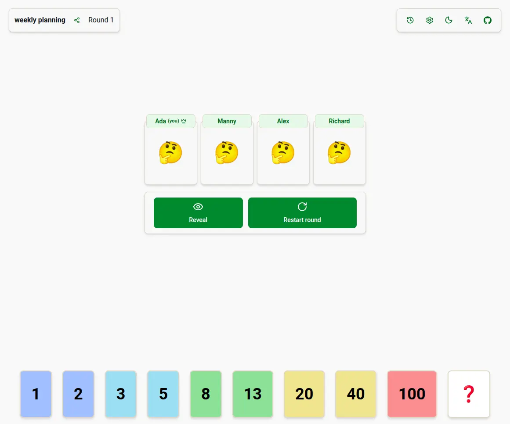

# Aestimo 

Aestimo is a planning poker web app



## Getting Started

To run this app quickly use [Docker](https://www.docker.com/):

```bash
$ cp .env.example .env
$ docker compose up -d
```

Open [http://localhost:3000](http://localhost:3000) with your browser to see the result.

## Why Aestimo is better

There are a lot of alternatives, even open-sourced ones here on github, but I find them lacking and/or overoverengineered. There are a bunch of project that can offer less but have a more convoluted tech stack that adds unnecessary complecity (e.g. using [Rust+TS+React+graphQL](https://github.com/INQTR/poker-planning) or [Python+Angular+websockets](https://github.com/axeleroy/self-host-planning-poker)), even though the same can be replicated using [server-sent events](https://developer.mozilla.org/en-US/docs/Web/API/Server-sent_events/Using_server-sent_events).

#### What Aestimo can offer:

| feature                          | Aestimo                                                                      | Others                                                                             |
| -------------------------------- | ---------------------------------------------------------------------------- | ---------------------------------------------------------------------------------- |
| Can be self-hosted               | ✅                                                                           | ✅/❌ Some projects rely heavily on SaaS platforms (Firebase, etc.)                |
| Themes                           | ✅ Light and dark themes                                                     | ✅/❌ (Some support dark theme)                                                    |
| Shows users' connection statuses | ✅                                                                           | ❌                                                                                 |
| Shows room's voting history      | ✅                                                                           | ❌                                                                                 |
| Cleaner room URLs                | ✅ You can create meaningful prefixes (e.g. `/plan-booking-feat-XXXXXXXXXX`) | ❌ Long unreadable UUIDs in the URL (e.g. `/68584ecc-07d8-800a-a58a-2c7c81b42f1c`) |
| Custom votes per room            | ✅ Customize both value AND color                                            | ❌ Can only customize value                                                        |
| Straightforward architecture     | ✅ TypeScript+Next.js, that's it                                             | ❌ mix of different languages + a lot of unnecessary packages                      |

## Acknowledgements

- [Next.js Documentation](https://nextjs.org/docs)
- [Planning Poker website](https://planning-poker-agile.web.app/) - This project took huge inspiration from [planning-poker](https://github.com/hellomuthu23/planning-poker), especially cards' color scheme. Support them with your star as well!
- [ray.so](https://ray.so/icon) - favicon is made with their icon builder.

## env

| Name                | Description                                                                                             | Default      |
| ------------------- | ------------------------------------------------------------------------------------------------------- | ------------ |
| PORT                |                                                                                                         | 3000         |
| NODE_ENV            | `production` or `development`                                                                           | `production` |
| SESSION_SECRET\*    | [should be 32+ characters long](https://github.com/vvo/iron-session?tab=readme-ov-file#session-options) |              |
| POSTGRES_USER\*     |                                                                                                         |              |
| POSTGRES_PASSWORD\* |                                                                                                         |              |
| POSTGRES_DB\*       |                                                                                                         |              |
| POSTGRES_HOST\*     |                                                                                                         |              |
| POSTGRES_PORT\*     |                                                                                                         |              |
